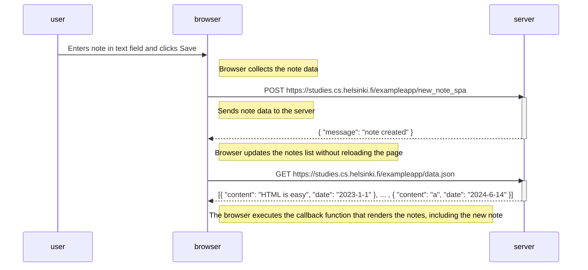

```mermaid
sequenceDiagram
    participant user
    participant browser
    participant server

    user->>browser: Enters note in text field and clicks Save
    Note right of browser: Browser collects the note data

    browser->>server: POST https://studies.cs.helsinki.fi/exampleapp/new_note_spa
    activate server
    Note right of browser: Sends note data to the server
    server-->>browser: { "message": "note created" }
    deactivate server

    Note right of browser: Browser updates the notes list without reloading the page

    browser->>server: GET https://studies.cs.helsinki.fi/exampleapp/data.json
    activate server
    server-->>browser: [{ "content": "HTML is easy", "date": "2023-1-1" }, ... , { "content": "a", "date": "2024-6-14" }]
    deactivate server

    Note right of browser: The browser executes the callback function that renders the notes, including the new note

```